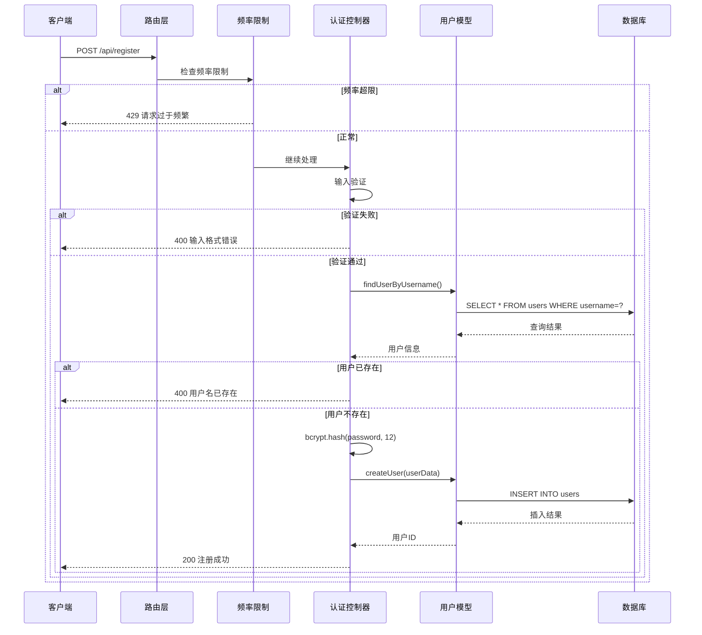
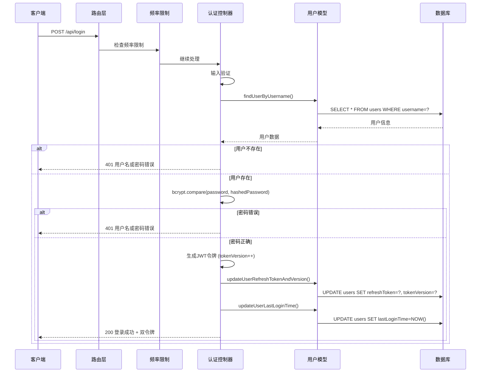
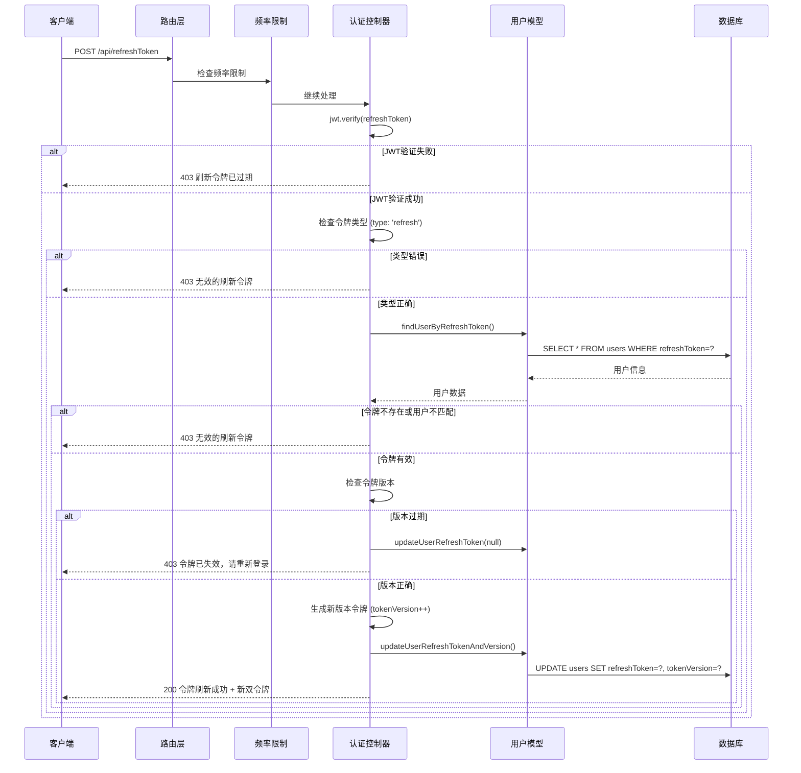
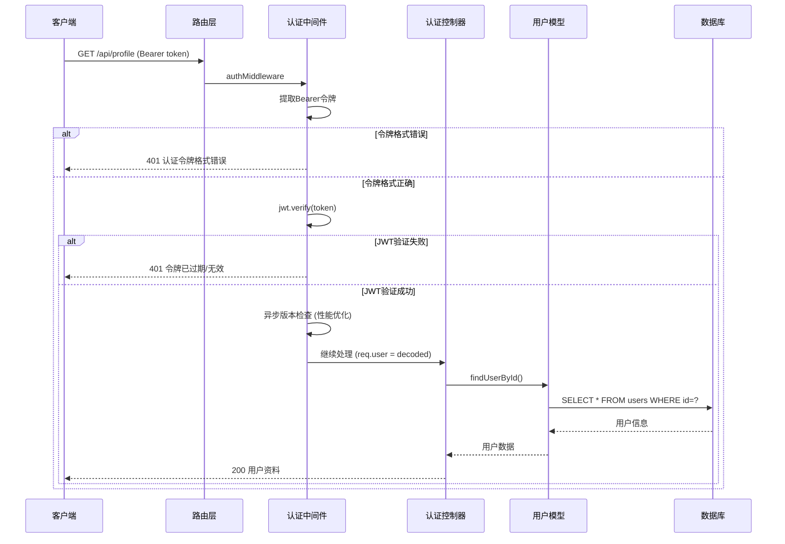
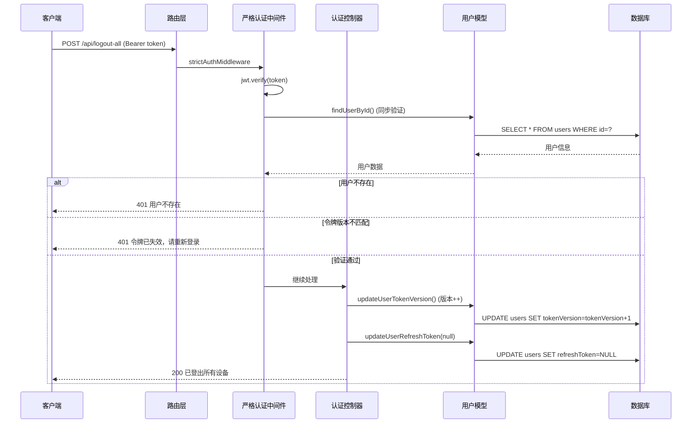
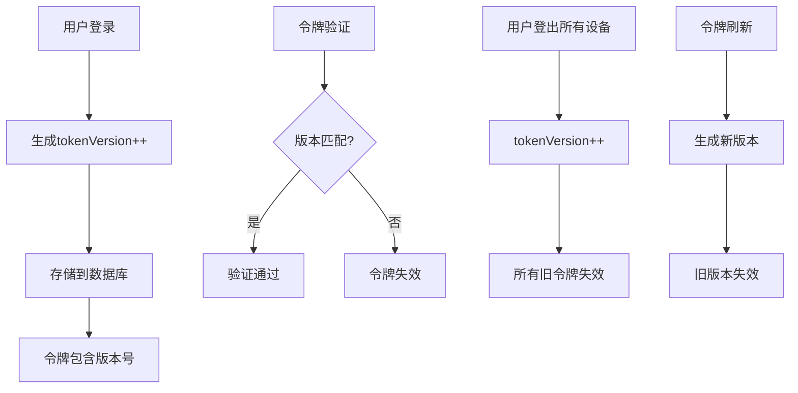
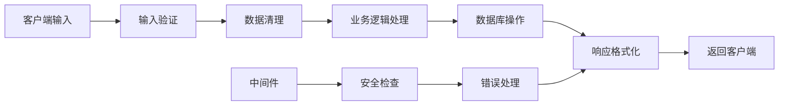
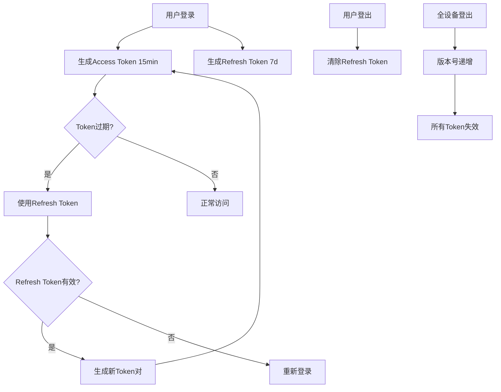

# 🔄 业务流程图详解

## 📊 系统交互时序图

### 1. 用户注册完整流程



### 2. 用户登录完整流程



### 3. 令牌刷新流程



### 4. 受保护资源访问流程



### 5. 严格认证流程 (全设备登出)



---

## 🔐 安全机制详解

### 1. 多层安全验证

```
请求 → 频率限制 → JWT验证 → 版本检查 → 业务逻辑
  ↓         ↓         ↓         ↓         ↓
拒绝 ← 超频阻断 ← 令牌无效 ← 版本过期 ← 权限不足
```

### 2. 令牌版本控制机制



### 3. 频率限制算法

```javascript
// 滑动窗口算法
function rateLimitCheck(ip, maxAttempts, windowMs) {
    const now = Date.now()
    const userAttempts = attempts.get(ip) || { 
        count: 0, 
        resetTime: now + windowMs 
    }
    
    // 时间窗口重置
    if (now > userAttempts.resetTime) {
        userAttempts.count = 0
        userAttempts.resetTime = now + windowMs
    }
    
    // 检查限制
    if (userAttempts.count >= maxAttempts) {
        return false // 被限制
    }
    
    userAttempts.count++
    return true // 允许通过
}
```

---

## 📊 数据流向图

### 用户数据流



### 令牌生命周期



---

## 🎯 关键业务决策点

### 1. 为什么使用双令牌机制？

**问题**: 单一令牌的困境
- 短期令牌：用户体验差，频繁登录
- 长期令牌：安全风险高，难以撤销

**解决方案**: 双令牌设计
- **Access Token**: 短期(15分钟)，用于API访问
- **Refresh Token**: 长期(7天)，用于令牌续期

**优势**:
- ✅ 平衡安全性和用户体验
- ✅ 支持令牌撤销和版本控制
- ✅ 减少密码传输频率

### 2. 为什么需要令牌版本控制？

**问题**: 传统JWT无法撤销
- 令牌在有效期内始终有效
- 无法主动使令牌失效
- 安全事件响应困难

**解决方案**: 版本控制机制
```javascript
// 每次关键操作都会递增版本号
tokenVersion++

// 验证时检查版本
if (decoded.tokenVersion !== user.tokenVersion) {
    // 令牌已过期
    return unauthorized()
}
```

**优势**:
- ✅ 即时撤销所有设备令牌
- ✅ 防止令牌重放攻击
- ✅ 支持安全事件响应

### 3. 为什么区分基础认证和严格认证？

**基础认证** (`authMiddleware`):
- 异步版本检查，性能优先
- 适用于一般API访问
- 平衡性能和安全

**严格认证** (`strictAuthMiddleware`):
- 同步版本验证，安全优先
- 适用于敏感操作
- 确保最高安全级别

---

## 🚀 性能优化策略

### 1. 异步处理
```javascript
// 基础认证中的异步版本检查
findUserById(decoded.userId).then(user => {
    if (user && user.tokenVersion !== decoded.tokenVersion) {
        console.warn(`用户 ${decoded.userId} 使用了过期版本的令牌`)
    }
}).catch(err => {
    console.error('令牌版本验证失败:', err)
})
```

### 2. 数据库索引优化
```sql
-- 关键查询的索引
INDEX idx_username (username)           -- 登录查询
INDEX idx_token_version (id, tokenVersion)  -- 版本验证
INDEX idx_refresh_token (refreshToken)  -- 令牌刷新
```

### 3. 内存缓存
```javascript
// 频率限制使用内存存储
const attempts = new Map()

// 定期清理过期记录
setInterval(cleanupExpiredAttempts, 60 * 60 * 1000)
```

---

这个业务逻辑设计充分考虑了**安全性**、**性能**和**用户体验**的平衡，是一个非常完善的现代化认证系统！ 